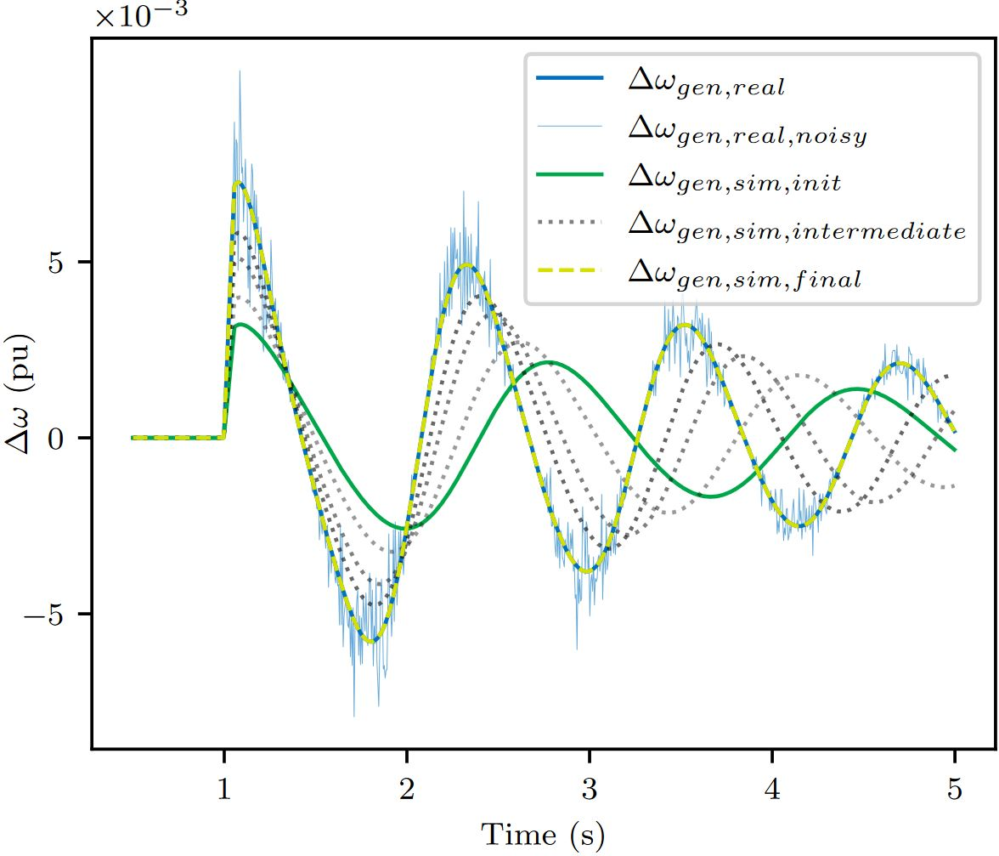
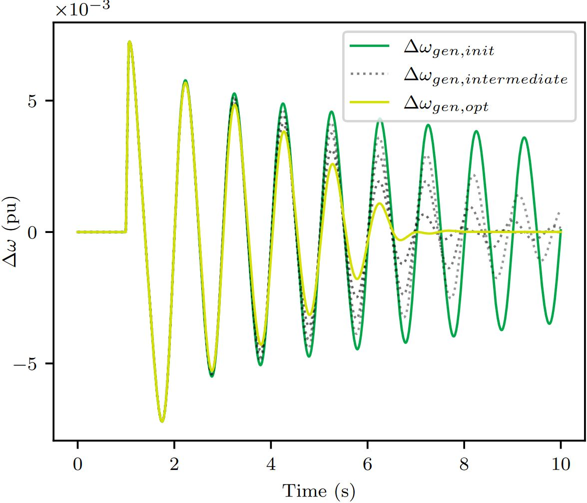

# power-system-parameter-optimization
## Introduction
This repository contains the code for the paper ["Parameter Identification and Optimization of Power
System Models Using the Backpropagation Method"](https://arxiv.org/abs/2309.16579) by Georg Kordowich and Johann Jaeger.
The repository contains simple examples for the identification of the parameters of a single machine infinite bus (SMIB)
model and the optimization of the parameters of a PSS the facilitate maximum damping for the SMIB.

The code is written in Python 3.9 and uses the requirements listed in `requirements.txt`. The simulation part is
strongly based on the works of ["Haugdal et al"](https://github.com/hallvar-h/DynPSSimPy), but required a simplification
and rewrite to facilitate the automatic differentiation.

## Method
The optimization of the parameters is done using the gradient descent method. The gradient is calculated using an 
automatic differentiation tool, namely PyTorch. For the optimization/identification of the parameters, the
method has 5 steps:
1. Run the power system simulation. During the simulation, the AD tool automatically builds a computational graph.
2. Use the output of the simulation to calculate a loss, e.g. the MSE loss between output of the simulation and desired output.
3. Use the AD tool to calculate the gradients of the loss function with respect to the simulation parameters by 
traversing the computational graph in the backward direction.
4. Use the gradients to calculate new values of the simulation parameters by applying the gradient descent method.
5. Repeat steps 1-4 until the loss is below a predetermined threshold.

## Usage
Install the requirements. Then, run the examples in the `examples` folder. The examples are:
- `parameter_identification.py`: Identification of the inertia of a generator SMIB model:

- `parameter_optimization.py`: Optimization of the parameters of a PSS to maximize the damping of a generator SMIB model:

